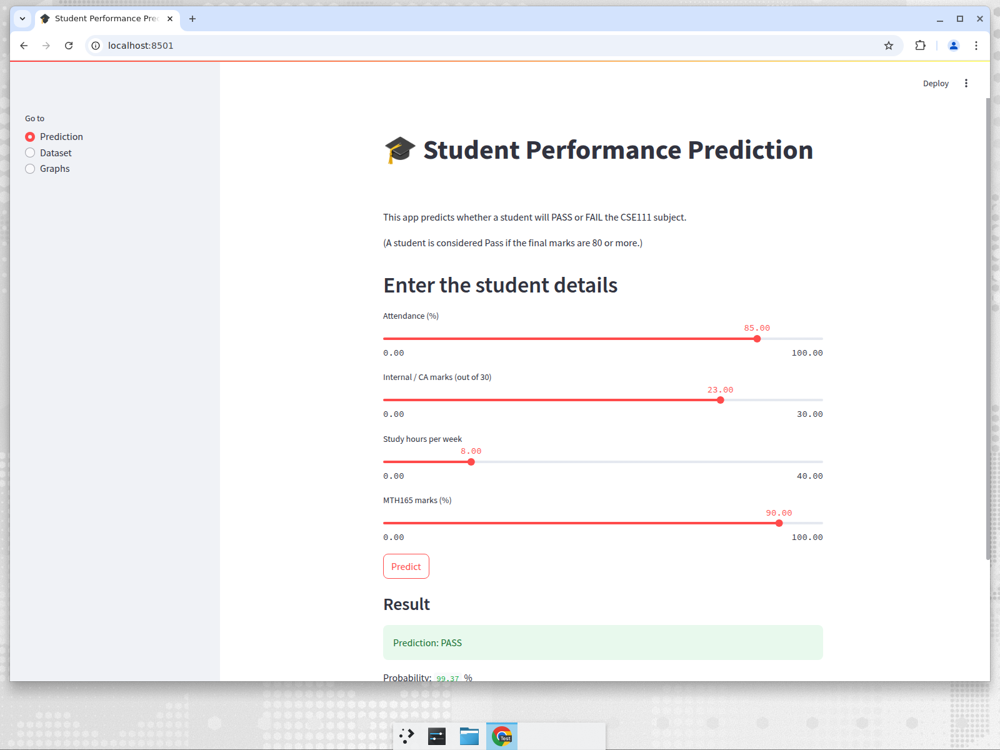

# Student Performance Prediction

B.Tech 2nd Year Mini Project (Machine Learning using Python)

This project predicts whether a student will **PASS** or **FAIL** the CSE111 subject by
using their attendance, internal (CA) marks, weekly study hours and MTH165 marks.
Two algorithms are used - **Logistic Regression** and **Decision Tree** - and the better
one is used in a **Streamlit** web app.

Example:

```
Input  : Attendance = 85%, Internal marks = 23/30,
         Study hours = 8 per week, MTH165 marks = 90%
Output : Prediction: PASS
         Probability: 99%
```

## Technology used

* Python
* Pandas, NumPy
* Matplotlib, Seaborn
* Scikit-learn
* Streamlit

## Files in the project

| File | What it does |
|------|--------------|
| `student_data.csv` | the dataset given for the project |
| `step1_data_cleaning.py` | cleans the data and makes the Pass/Fail column |
| `step2_eda.py` | data analysis and graphs |
| `step3_train_models.py` | trains both models, compares them and saves the best one |
| `step4_prediction.py` | prediction system (also used by the app) |
| `step5_testing.py` | testing of the prediction system |
| `app.py` | Streamlit web app |
| `clean_student_data.csv` | file created by step 1 |
| `models/student_model.pkl` | the saved trained model |
| `images/` | all the graphs |
| `docs/` | project report, PPT points and viva questions |

## How to run

```
pip install -r requirements.txt

python step1_data_cleaning.py
python step2_eda.py
python step3_train_models.py
python step5_testing.py

streamlit run app.py
```

For a single prediction from the terminal:

```
python step4_prediction.py
```



## About the dataset

The file has 1000 rows. 5 rows had the same StudentID so they were removed and
**995 students** are left.

| Column | Meaning |
|--------|---------|
| StudentID | roll number of the student |
| Attendance_Percentage | attendance in percentage |
| Weekly_Study_Hours | how many hours the student studies in a week |
| CA_Marks | internal marks out of 30 |
| MTH165_Final_Grade | marks of the Maths subject |
| CSE111_Final_Grade | marks of the CSE111 subject |

The dataset does not have a Pass/Fail column, so we made it ourselves:

```
result = 1 (PASS)  if CSE111_Final_Grade >= 80
result = 0 (FAIL)  if CSE111_Final_Grade < 80
```

We could not take 40 marks as the pass mark because the lowest marks in the file are 59,
so every student would become Pass and the model would have nothing to learn.
With 80 marks we get 750 Pass students and 245 Fail students.

## What we found in the EDA

* Out of 995 students, 750 passed and 245 failed.
* Relation with the result: MTH165 marks 0.74, study hours 0.56, internal marks 0.25,
  attendance 0.05.
* Pass students study 8.9 hours a week on average and Fail students only 5.3 hours.
* Attendance is almost the same for both groups (85.2% and 84.5%) because in this
  dataset every student already has more than 75% attendance.

## Result

| Model | Accuracy |
|-------|----------|
| Logistic Regression | **98.99 %** |
| Decision Tree | 96.48 % |

**Logistic Regression** gave better accuracy, so it is saved in
`models/student_model.pkl` and used in the app.

The accuracy is very high because the MTH165 marks and the CSE111 marks are very close
to each other in this dataset (relation 0.94), so the model is able to guess easily.

## Limitations and future work

* The pass mark 80 is decided by us, it is not the official college pass mark.
* Attendance did not help much because all the students in the file have good attendance.
* In future we can use a bigger real dataset, add assignment marks and previous semester
  marks, and also try other algorithms like Random Forest.
